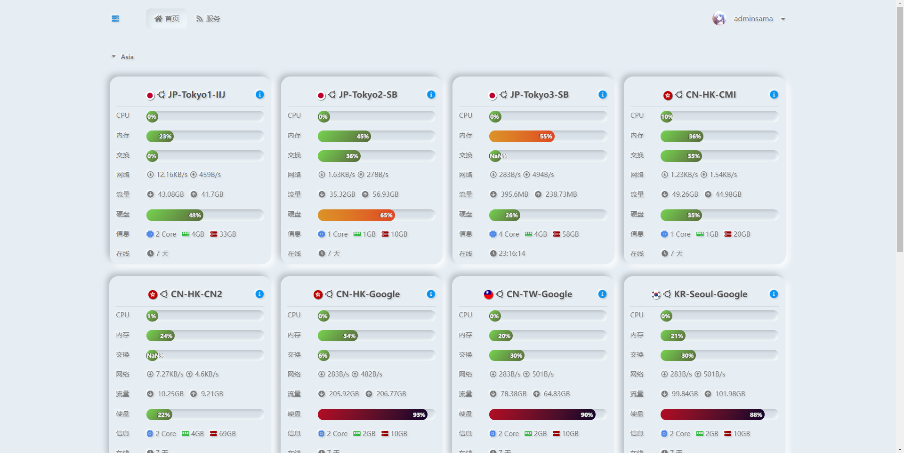

   
  
   
  <small><i>LOGO designed by <a href="https://xio.ng" target="_blank">熊大</a> .</i></small>
    
&nbsp;&nbsp;&nbsp;
   
   
  
:trollface: <b>Nezha Monitoring: Self-hostable, lightweight, servers and websites monitoring and O&M tool.</b>

  
Supports <b>monitoring</b> system status, HTTP (SSL certificate change, upcoming expiration, expired), TCP, Ping and supports <b>push alerts</b>, run scheduled tasks and <b>web terminal</b>.

\>> Telegram Group: [Nezha Monitoring Global (English Only)](https://t.me/nezhamonitoring_global), [哪吒监控（中文群组）](https://t.me/nezhamonitoring)

\>> [Use Cases | 我们的用户](https://www.google.com/search?q=%22powered+by+Nezha+Monitoring%22+OR+%22powered+by+%E5%93%AA%E5%90%92%E7%9B%91%E6%8E%A7%22) (Google)  

\>> **欢迎正在使用本项目且想要改进的 UI 设计师、Web 前端工程师、Go 工程师 联系 hi#nai.ba 一起参与下个版本贡献。**

\>> **Welcome UI designers, Web front-end engineers, and Go engineers who are using this project and want to improve it contact hi#nai.ba and contribute to THE NEXT VERSION together.**

## User Guide

- [English](https://nezhahq.github.io/en_US/index.html)
- [中文文档](https://nezhahq.github.io/index.html)

## Screenshots

| Default Theme                                                                                 | DayNight [@JackieSung](https://github.com/JackieSung4ev)                                               | hotaru                                                                     |
| ---------------------------------------------------------------------------------------- | ------------------------------------------------------------------------------------------------------ | -------------------------------------------------------------------------- |
|                               |                             |  |
| 
<b>Default modified <a href="https://ww.ws/43.html">[Guide]</a></b>
 | 
<b>Neko Mdui <a href="https://github.com/MikoyChinese">@MikoyChinese</a></b>
 |      
<b>AngelKanade <a href="https://github.com/adminsama">@adminsama</a></b>
         |
|        |                                               |                    |

## Supported Languages

- English
- 中文
- Español

You can change the dashboard language in the settings page (`/setting`) after the dashboard is installed.

## Contributors

<!--GAMFC_DELIMITER-->

<!--GAMFC_DELIMITER_END-->

## Star History

